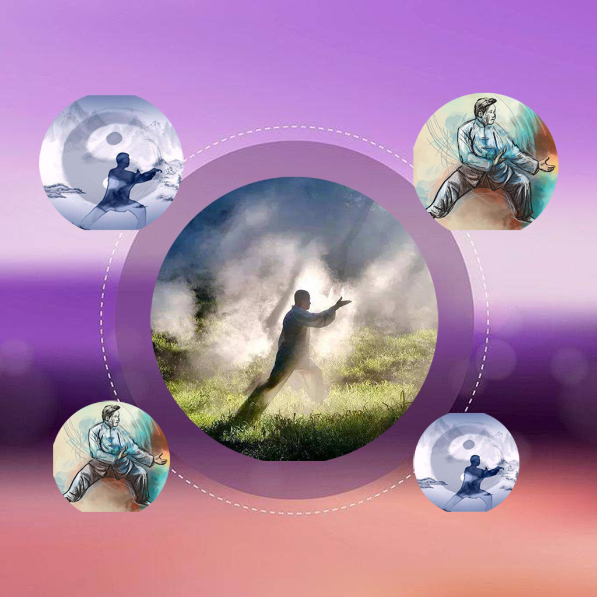

## Welcome to My TaiChi Learning Record Tool

Do you like tai chi? Tai chi practice is not only a physical exercise, but also an art. If you also like tai chi, this app will help you learn and record the process of tai chi. You can record the ways you learned tai chi, the ways you practiced it, the skills you learned and the experiences you gained. You can also save a list of your favorite tai chi exercises for later practice and review.

If you have any questions, you can either leave a message or send the questions to our email address.

We will answer them for you in the first time.

### Address: sun778297ma@163.com

Thank you!
